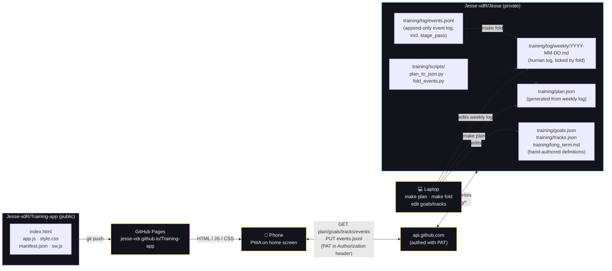
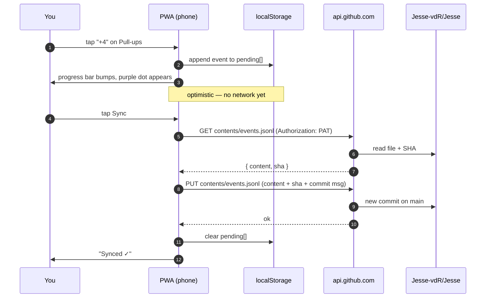

# Training-app

Mobile PWA for logging calisthenics sets and tracking long-horizon goals.

- **Today** view: tap to log sets, holds, runs against the current week's plan.
- **Project** view: goal cards with pace, per-track stage ladders, intensity-weighted tonnage bars, 26-week heatmap. Pass stages from the same screen.

Each tap appends one structured event to a file in a separate, private repo; a script in that repo folds the events back into a human-readable weekly log on Sunday. Goals and stage ladders are hand-authored JSON in the same private repo — the PWA fetches them on every launch and recomputes all graphs client-side.

Live at **https://jesse-vdr.github.io/Training-app/**.

## The whole flow



## What a single tap does



## Features

- **Two views** — bottom tab switches between **Today** (log sets) and **Project** (goal progress, stages, tonnage, heatmap). Choice persists per-device.
- **Goal cards** — one per active goal. Filled bar = current weighted progress, vertical tick = where you should be by today given the deadline. Pace chip is green/amber/red.
- **Track ladder** — tap a goal to expand. Each contributing track shows discrete stage dots, the next stage's acceptance test, and a "Pass stage N" button.
- **Stage logging** — tapping "Pass stage N" prompts for an optional note and appends a `stage_pass` event. Same sync flow as set events. Cancellation aborts.
- **8-week tonnage bars** — under each goal, one row per track. Bars are intensity-weighted volume, normalised across the goal's tracks so the tallest bar in the cluster is full-height.
- **26-week heatmap** — bottom of the Project view. GitHub-style 7×26 grid, color = total daily intensity score. Future cells are dimmed.
- **Day-by-day navigation** — prev/next arrows cycle through the week. Future days are read-only; past days allow retro-logging.
- **Purple → orange progress gradient** — each bar fills from deep purple (empty) through pink (halfway) to orange (target met). Matches the `brynq-ai-toolkit` style guide.
- **Per-set tapping** — one tap = one set at spec reps/seconds. The catalog lives in `Jesse-vdR/Jesse/training/scripts/catalog.py`.
- **Double-tap to undo** — fat-fingered a tap? Tap the same `+N` button again within ~350 ms to remove the just-logged pending event. Works for reps, walks, and holds. Sessions (runs) toggle on/off with one tap while still pending.
- **Offline-first** — the app shell is service-worker cached. Events queue locally in `localStorage`; press Sync when you're back online. Taps never wait for the network.
- **No backend** — the repo *is* the database. All writes go straight to GitHub with your PAT.
- **Installable** — iOS: Share → *Add to Home Screen*. Android: install prompt appears automatically. Standalone app, no URL bar.

## Privacy model

- This repo (`Training-app`) is public. It contains **zero data** — just HTML/JS/CSS that knows how to talk to GitHub's API.
- Training data lives in the separate **private** repo `Jesse-vdR/Jesse`. Pages cannot see into it; only calls authenticated with your PAT can.
- Your PAT is stored only in `localStorage` on your phone, scoped to this origin. It is never uploaded, logged, or sent anywhere except `api.github.com`.
- Anyone can visit this URL. Nobody else can read or write your training data without your PAT.

See [`docs/setup.md`](#pat-setup) below for the exact token scoping.

## PAT setup

Create a **fine-grained** personal access token at <https://github.com/settings/personal-access-tokens/new>:

| Field | Value |
|---|---|
| Token name | `training-pwa` |
| Expiration | 1 year (or whatever) |
| Resource owner | `Jesse-vdR` |
| Repository access | Only select repositories → `Jesse-vdR/Jesse` |
| Repository permissions → **Contents** | **Read and write** |
| Repository permissions → Metadata | Read-only (auto-enabled) |
| Everything else | No access |

Copy the token once shown, open the PWA, tap ⚙, paste, Save.

## Event schema

Each tap appends one JSON object as a single line to `training/log/events.jsonl`:

```json
{"ts":"2026-04-20T19:21:24.286Z","local_date":"2026-04-20","exercise":"wide_pushups","kind":"set","reps":10}
{"ts":"2026-04-20T19:21:32.708Z","local_date":"2026-04-20","exercise":"pike_compression","kind":"hold","duration_s":30}
{"ts":"2026-04-22T08:45:12.000Z","local_date":"2026-04-22","exercise":"run","kind":"run"}
{"ts":"2026-09-12T11:00:00.000Z","local_date":"2026-09-12","kind":"stage_pass","track":"pulling","stage":2,"note":"5 strict CTB"}
```

| Field | Notes |
|---|---|
| `ts` | UTC ISO 8601. For absolute ordering. |
| `local_date` | Calendar date as of the tap (YYYY-MM-DD). The fold script groups by this, so late-night taps don't spill into the next UTC day. |
| `exercise` | Slug from the catalog (`pullups`, `wide_pushups`, `pike_pushups`, `dips`, `wall_walk`, `ctw_handstand`, `pancake`, `pike_compression`, `run`, `bouldering`). Absent on `stage_pass`. |
| `kind` | `set` \| `hold` \| `run` \| `session` \| `bouldering` \| `stage_pass` |
| `reps` | Present on `set` events — per-set count. |
| `duration_s` | Present on `hold` events — per-set seconds. |
| `track` | Present on `stage_pass` — track id from `tracks.json`. |
| `stage` | Present on `stage_pass` — integer stage number passed. |
| `note` | Optional on `stage_pass` — short free-text description. |

Append-only: the PWA never edits or deletes prior events remotely. Undo only affects pending (unsynced) events locally.

## Goals & tracks

The Project view is driven by two more files in `Jesse-vdR/Jesse/training/`:

- `goals.json` — list of goals with deadlines, acceptance criteria, and the contributing tracks (with weights + target stages).
- `tracks.json` — list of tracks, each a ladder of stages with acceptance tests and the exercises that feed them.

Both are hand-authored. They're small enough not to need tooling. Edit, push, refresh.

A goal's progress is the weighted average of `current_stage / target_stage` across its tracks. The pace marker on the goal bar is `(today − start_date) / (deadline − start_date)`. Volume (intensity score) is shown separately in the tonnage bars and heatmap — it's an input, not a progress measure.

## Cadence

### During training (phone)

Tap reps as you go. Hit a milestone? Project tab → tap the goal → **Pass stage N** on the relevant track → optional note → Sync. One Sync at the end of the session is enough; the queue persists across app restarts.

### Sunday evening (laptop, ~15 min)

```bash
cd ~/personal_projects/training
make fold            # ticks last week's checkboxes from events
git diff             # eyeball what flipped
```

Reflect — three questions, two minutes:

1. **What did the body say no to this week?** (skipped sets, painful reps, bad sleep)
2. **Which track moved?** (Project view — any ladder dot fill in?)
3. **What's the one thing I'm changing for next week?** (one — not five)

Edit / create `log/weekly/<next-monday>.md`. Then:

```bash
make plan            # rebuilds plan.json from the new week's log
git add training/log training/plan.json
git commit -m "fold W{n} + plan W{n+1}: <answer to #3>"
git push
```

The PWA picks up the new plan within seconds of the push. `fold` is idempotent and never un-ticks.

### Quarterly (Apr / Jul / Oct / Jan, ~30 min)

- Open Project view, scan the goal cards. Read `long_term.md` against current state.
- Goal *consistently ahead* → raise the bar (earlier deadline, higher target stage).
- Goal *behind two quarters in a row* → that's the trigger to amend, not adjust.
- Add a dated entry to the **Amendments** section at the bottom of `long_term.md` describing what changed and why.
- Then make the change in data: edit `goals.json` (push a deadline, mark `"status": "met"`, add a goal) or `tracks.json` (insert/split a stage).
- Recalibrate `difficulty_factor` if subjective effort doesn't match the tonnage bar heights.

### Ad-hoc

- **New exercise:** add to `scripts/catalog.py` *and* the `DIFFICULTY` map at the top of `app.js` (see Known warts), then reference it in the relevant `tracks.json` stage.
- **Goal met:** in `goals.json`, set `"status": "met"`. It greys out and drops to a Completed section.
- **Goal paused / dropped:** same with `"paused"` or `"dropped"`.

## What's automatic vs. manual

Everything in the Project view recomputes on every PWA launch — no refresh button needed.

| Updates automatically (on Sync / next launch) | Requires a `git push` from laptop |
|---|---|
| Today view progress bars | The week's plan (`make plan`) |
| Goal pace, ladder dots, tonnage bars, heatmap | New goals / stages / status changes |
| Stage progress (after tapping "Pass stage N") | Difficulty factors |
| Days remaining, expected-by-today tick |  |

## Known warts

- **Difficulty factors live in two places.** `scripts/catalog.py` (used by `fold` and any future Python tooling) and the `DIFFICULTY` constant at the top of `app.js` (used by tonnage bars + heatmap). Changing one without the other will silently desync. Eventual fix: a Makefile target that emits `catalog.json` from `catalog.py`, fetched by the PWA.
- **`events.jsonl` is one file.** At ~10 events/day it'll cross ~1 MB sometime in 2027. When it does, shard by year (`events-2026.jsonl`, etc.) and update the parse path in `app.js`.

## Layout

```
├── index.html         # shell, tab nav, settings panel
├── app.js             # state, GitHub API, today + project views, sync, undo
├── style.css          # dark theme, purple→orange gradient, ladder/heatmap
├── manifest.json      # PWA manifest
├── sw.js              # service worker (cache app shell, bypass api.github.com)
├── icon-192.png       # placeholder pull-up-bar silhouette
└── icon-512.png
```

No build step, no framework, no dependencies. Edit a file, push, refresh.
