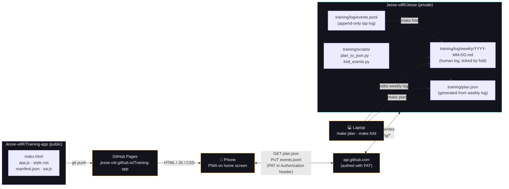
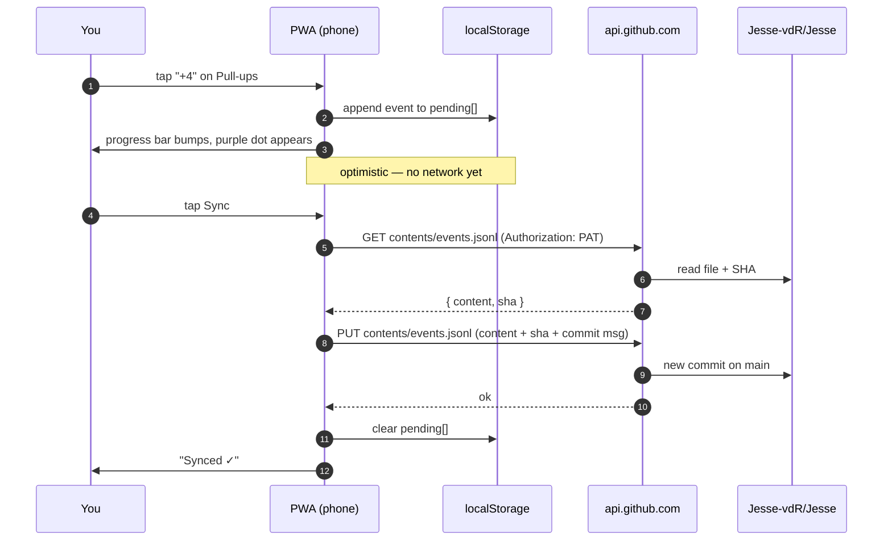

# Training-app

Mobile PWA for logging calisthenics sets throughout the day. Each tap appends one structured event to a file in a separate, private repo; a script in that repo folds the events back into a human-readable weekly log on Sunday.

Live at **https://jesse-vdr.github.io/Training-app/**.

## The whole flow



## What a single tap does



## Features

- **Day-by-day navigation** — prev/next arrows cycle through the week. Future days are read-only; past days allow retro-logging.
- **Purple → orange progress gradient** — each bar fills from deep purple (empty) through pink (halfway) to orange (target met). Matches the `brynq-ai-toolkit` style guide.
- **Per-set tapping** — one tap = one set at spec reps/seconds. The catalog lives in `Jesse-vdR/Jesse/training/scripts/catalog.py`.
- **Double-tap to undo** — fat-fingered a tap? Tap the same `+N` button again within ~350 ms to remove the just-logged pending event. Works for reps, walks, and holds. Sessions (runs) toggle on/off with one tap while still pending.
- **Offline-first** — the app shell is service-worker cached. Events queue locally in `localStorage`; press Sync when you're back online. Taps never wait for the network.
- **No backend** — the repo *is* the database. All writes go straight to GitHub with your PAT.
- **Installable** — iOS: Share → *Add to Home Screen*. Android: install prompt appears automatically. Standalone app, no URL bar.

## Privacy model

- This repo (`Training-app`) is public. It contains **zero data** — just HTML/JS/CSS that knows how to talk to GitHub's API.
- Training data lives in the separate **private** repo `Jesse-vdR/Jesse`. Pages cannot see into it; only calls authenticated with your PAT can.
- Your PAT is stored only in `localStorage` on your phone, scoped to this origin. It is never uploaded, logged, or sent anywhere except `api.github.com`.
- Anyone can visit this URL. Nobody else can read or write your training data without your PAT.

See [`docs/setup.md`](#pat-setup) below for the exact token scoping.

## PAT setup

Create a **fine-grained** personal access token at <https://github.com/settings/personal-access-tokens/new>:

| Field | Value |
|---|---|
| Token name | `training-pwa` |
| Expiration | 1 year (or whatever) |
| Resource owner | `Jesse-vdR` |
| Repository access | Only select repositories → `Jesse-vdR/Jesse` |
| Repository permissions → **Contents** | **Read and write** |
| Repository permissions → Metadata | Read-only (auto-enabled) |
| Everything else | No access |

Copy the token once shown, open the PWA, tap ⚙, paste, Save.

## Event schema

Each tap appends one JSON object as a single line to `training/log/events.jsonl`:

```json
{"ts":"2026-04-20T19:21:24.286Z","local_date":"2026-04-20","exercise":"wide_pushups","kind":"set","reps":10}
{"ts":"2026-04-20T19:21:32.708Z","local_date":"2026-04-20","exercise":"pike_compression","kind":"hold","duration_s":30}
{"ts":"2026-04-22T08:45:12.000Z","local_date":"2026-04-22","exercise":"run","kind":"run"}
```

| Field | Notes |
|---|---|
| `ts` | UTC ISO 8601. For absolute ordering. |
| `local_date` | Calendar date as of the tap (YYYY-MM-DD). The fold script groups by this, so late-night taps don't spill into the next UTC day. |
| `exercise` | Slug from the catalog (`pullups`, `wide_pushups`, `pike_pushups`, `dips`, `wall_walk`, `ctw_handstand`, `pancake`, `pike_compression`, `run`, `bouldering`). |
| `kind` | `set` \| `hold` \| `run` \| `session` \| `bouldering` |
| `reps` | Present on `set` events — per-set count. |
| `duration_s` | Present on `hold` events — per-set seconds. |

Append-only: the PWA never edits or deletes prior events remotely. Undo only affects pending (unsynced) events locally.

## Keeping `plan.json` fresh

Every Monday (or whenever the weekly log changes) in `Jesse-vdR/Jesse`:

```bash
cd training
make plan    # regenerates plan.json from log/weekly/<this monday>.md
git commit -am "plan: refresh for week of YYYY-MM-DD"
git push
```

The PWA reads `plan.json` on each launch, so a git push propagates within seconds.

## Sunday review

```bash
cd training
make fold    # ticks weekly-log checkboxes for every target met by events
git diff     # inspect what was flipped
git commit -am "fold: week of YYYY-MM-DD"
```

`fold` is idempotent and never un-ticks. Partials are still discussed verbally, not inline.

## Layout

```
├── index.html         # shell + settings panel
├── app.js             # state, rendering, GitHub API, sync, double-tap undo
├── style.css          # dark theme, purple→orange gradient
├── manifest.json      # PWA manifest
├── sw.js              # service worker (cache app shell, bypass api.github.com)
├── icon-192.png       # placeholder pull-up-bar silhouette
└── icon-512.png
```

No build step, no framework, no dependencies. Edit a file, push, refresh.
